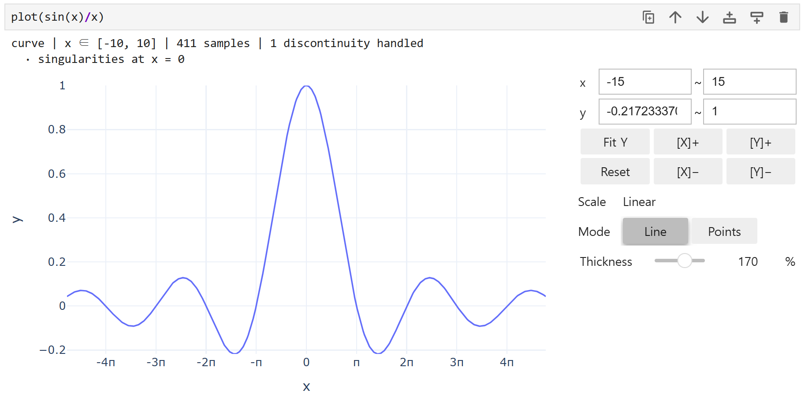
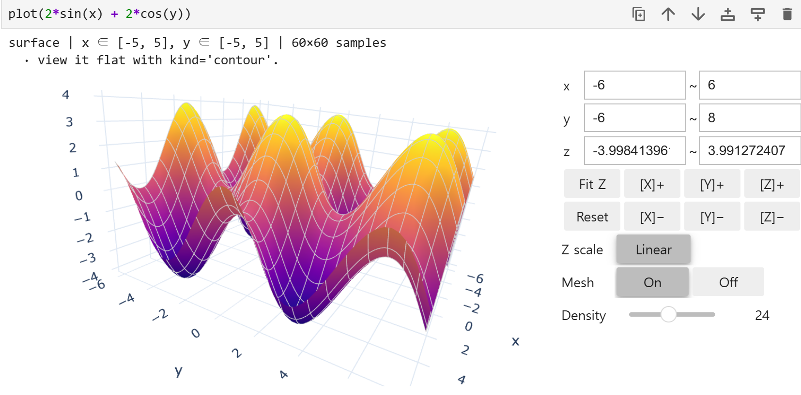

# MathSlate

**함께 성장하는 수학 워크스페이스.**

MathSlate는 SymPy, NumPy, Plotly를 조화롭게 구성하여, 학습자가 첫 그래프를 그리는 것부터 도구를 바꾸지 않고도 실제 과학 컴퓨팅으로 나아갈 수 있도록 돕는 수학 워크스페이스입니다.

```python
from mathslate import *

plot(sin(x)/x)
```

```
curve | x ∈ [-10, 10] | 411 samples | 1 discontinuity handled
  · singularities at x = 0
```



이것이 첫 번째 레슨의 전부입니다. `symbols`, `lambdify`, `linspace`, `figure`, `show`와 같은 설정은 필요하지 않습니다. 그러한 도구를 사용할 준비가 되었다면, 다음과 같이 요청하세요:

```python
plot(sin(x)/x).show_python()
```

그러면 MathSlate는 동일한 그림을 생성하는 순수 NumPy + SymPy + Plotly 코드를 출력합니다. 여기에는 그동안 사용자를 대신해 조용히 수행했던 모든 설정이 포함되어 있습니다.

---

## 설치

아래 세 가지 중 자신에게 맞는 경로를 선택하세요.

### 1. 이미 Python 환경이 있는 경우

```bash
pip install mathslate
```

프론트엔드 관련 패키지는 함께 제공되지 않습니다. 노트북 환경에 필요한 것을 추가하세요:

```bash
pip install "mathslate[jupyter]"   # ipywidgets + anywidget까지 함께 설치
pip install "mathslate[marimo]"
```

### 2. Python이 낯설거나, 번거로운 설정을 피하고 싶은 경우

명령 한 번이면 됩니다 — [uv](https://docs.astral.sh/uv/)가 없으면 먼저 설치하고, 가상환경을 만들고, mathslate를 설치하고, import가 이미 채워진 시작용 노트북을 만들어 Jupyter Lab으로 열어줍니다:

```bash
curl -LsSf https://astral.sh/uv/install.sh | sh   # `uv --version`이 이미 되면 생략
bash scripts/quickstart.sh
```

```powershell
irm https://astral.sh/uv/install.ps1 | iex   # `uv --version`이 이미 되면 생략
scripts\quickstart.ps1
```

이 스크립트가 실제로 실행하는 내용입니다 — 직접 입력하거나 커스터마이즈하고 싶다면 참고하세요:

```bash
uv venv .venv-mathslate
uv pip install --python .venv-mathslate "mathslate[jupyter]"   # ipywidgets + anywidget까지 함께 설치됨
.venv-mathslate/bin/python -m jupyter lab
```

(Windows에서는 `.venv-mathslate/Scripts/python.exe`입니다. 저장소를 클론한 위치에서 실행했을 때 기존 개발용 환경을 덮어쓰지 않도록, 관례적인 `.venv` 대신 별도 이름을 씁니다.)

노트북마다 필요한 건 첫 셀에 이 한 줄뿐입니다:

```python
from mathslate import *
```

이 import 하나가 **설정의 전부**입니다 — 이 문서에 나오는 `plot`, `analyze`, `sin`, `x` 등 모든 것이 여기서 나옵니다. `ipywidgets`/`anywidget`을 직접 import할 일은 없습니다 — mathslate가 `slider()` 내부에서 사용합니다.

marimo를 쓰려면 extra를 `marimo`로, 마지막 줄을 `-m marimo edit`으로 바꾸면 됩니다.

### 3. 설치 없이 그냥 평가만 해보려는 경우

로컬 설치 없이 브라우저에서 바로 실행되는 미리보기(JupyterLite)가 다음 주소에 있습니다: **https://berd2.github.io/mathslate/**. 모든 연산이 브라우저 안에서 Pyodide로 돌아가기 때문에 로컬 설치보다 느리며, 첫 import 전에 셀 하나를 추가로 실행해야 합니다:

```python
import piplite
await piplite.install("mathslate")
```

이 경로는 5분짜리 둘러보기용으로만 생각하시고, 실제로 쓰실 때는 1번이나 2번 경로로 넘어오세요.

> **marimo 사용자:** marimo는 파싱 시점에 `import *`를 거부합니다. 반응형 그래프를 구축하기 위해 각 셀이 정의하는 이름을 정적으로 알아야 하기 때문입니다. 대신 명시적으로 임포트하세요. 나머지는 모두 동일합니다. [매뉴얼](docs/manual_ko.md#marimo-forbids-import-)을 참조하세요.
>
> ```python
> from mathslate import plot, polar, sin, cos, tan, exp, sqrt, x, y, t
> ```

## 단 하나의 규칙

`plot()`은 사용자의 의도를 추론합니다. 기억해야 할 규칙은 단 한 가지뿐입니다:

- **리스트(list)**는 *여러 개를 함께* 의미합니다.
- **튜플(tuple)**은 *하나의 벡터 값 객체*를 의미합니다.

```python
plot([sin(x), cos(x)])     # 두 곡선을 중첩
plot((sin(t), cos(t)))     # 하나의 매개변수 곡선
```



그 외의 모든 것은 디스패치 규칙을 따릅니다:

| 입력 | 자유 기호 (Free symbols) | 결과 |
|---|---|---|
| `Expr` | 1 | 2D 곡선 |
| `Expr` | 0 | 수평선 + 메시지 |
| `list[Expr]` | 1개 공유 | 중첩된 곡선들 |
| `tuple[Expr, Expr]` | 1개 공유 | 2D 매개변수 곡선 |
| `callable` | — | 수치 샘플링 |
| 배열 형태 (array-like) | — | 데이터 시리즈 |
| `(xdata, ydata)` | — | 산점도 (scatter) |
| `Expr` | 2 | 곡면, 평면으로 보려면 `kind="contour"` |
| `Eq(lhs, rhs)` | 2 | 음함수 곡선 |
| `tuple[Expr × 3]` | 1 또는 2 | 공간 곡선 / 매개변수 곡면 |

원칙적으로 추론이 불가능한 두 가지 경우에는 명시적으로 지정해야 합니다:

```python
polar(1 + cos(t))                # r = f(θ)는 y = f(x)와 구분할 수 없습니다
plot(x*y, kind="contour")        # 곡면(surface) vs. 등고선(contour)
```

모든 호출은 무엇을 추론했는지 한 줄로 보고합니다. 이 줄은 단순한 로그가 아니라, 작성하지 않은 매개변수가 존재한다는 것을 처음으로 학습하게 되는 곳입니다.

## 어떤 기호가 축이 되는가

1. 명시적 범위가 우선합니다 — `plot(a*sin(x), (a, -1, 1))`
2. 바인딩된 매개변수는 절대 축이 될 수 없습니다 — `plot(a*sin(x), parameters={a: 3})`
3. 그렇지 않으면 관례적 순서를 따릅니다: `x, y, z` → `t, u, v` → `r, θ` → 알파벳순
4. 여전히 모호한 경우 MathSlate는 추측하지 않고 직접 묻습니다.

## 어려운 부분: 불연속성

MathSlate가 단순한 플로팅 래퍼와 차별화되는 점은 `plot(tan(x))`에서 잘못된 수직선이 그려지지 않는다는 것입니다. 이 문서의 다른 모든 것은 편의성에 불과합니다.

```python
plot(tan(x))      # 모든 극점(pole)에서 끊김, 2~98백분위수의 y 창(window) 사용
plot(1/x)         # 0에서 끊김
plot(floor(x))    # 모든 정수에서 끊김
plot(sqrt(x))     # 실수 정의역을 벗어나면 샘플링하지 않음
plot(x/abs(x))    # 0에서 끊김
```

구현 방법 (순서대로):

1. **기호적 특이점(Symbolic singularities)**은 `sympy.calculus.singularities`에서 가져오며, 절대 추측하지 않습니다.
2. **실수 정의역(Real domain)**은 `sympy.calculus.util.continuous_domain`에서 가져오며, 이 영역을 벗어나서 샘플링하지 않습니다.
3. **적응형 세분화(Adaptive subdivision)**: 200개의 균일한 점으로 시작하여, 인접한 세 점이 구부러지는 부분의 중간점을 최대 깊이 8, 최대 5000개의 점까지 추가합니다.
4. **선 끊기(Line breaking)**: 모든 불연속점에서 NaN을 반환합니다. SymPy가 감지하지 못하는 점프(`floor`, `sign`, `Piecewise`)는 이분법(bisection)을 통해 찾습니다. 진짜 점프는 간격이 줄어들어도 크기가 유지되지만, 단순히 가파른 기울기는 그렇지 않습니다.
5. **Y 클리핑(Y-clipping)**: 가시적인 창(window)은 극점 부근의 샘플을 제외한 2번째에서 98번째 백분위수에서 가져옵니다.
6. **벡터화된 평가(Vectorised evaluation)**: `lambdify(modules="numpy")`를 사용하며, 실패할 경우 요소 단위(element-wise) 평가로 요란하게(loudly) 폴백합니다. 절대로 조용히 넘어가지 않습니다. 마지막 요소 단위 단계는 SymPy 고유의 `evalf`이며, 이 덕분에 숫자 백엔드가 지원하지 않는 `zeta`, `Si`, `besselj` 등도 플로팅할 수 있습니다.

이 여섯 가지 방법은 매개변수 및 극좌표 곡선에도 모두 적용됩니다. 이 경우 연속적인 조각은 두 구성 요소 정의역의 교집합이 되며, 점프 탐지기는 `y(t)`뿐만 아니라 `x(t)`도 관찰합니다. 또한 창은 가로로도 클리핑됩니다. `x`가 축일 때는 불가능한 방식으로 `x(t)`가 극점에 도달할 수 있기 때문입니다.

```python
plot((tan(t), t))    # t = π/2 및 3π/2에서 끊기며, 10¹⁶까지 그려지지 않음
polar(tan(t))        # 극좌표 감소(polar reduction)를 통해 동일하게 처리됨
```

## 함수란 무엇인가: `analyze()`

명시적이며 절대 자동으로 실행되지 않습니다. 속성을 감지하는 것은 모든 플롯에서 실행하기에는 너무 느리고 노이즈가 많습니다.

```python
analyze(x**3 - 3*x)      # 근 -sqrt(3), 0, sqrt(3); 최댓값 -1; 최솟값 1
analyze(1/x)             # x = 0 수직점근선; y = 0 양끝 수평점근선; 기함수(odd)
plot(tan(x)).analyze()   # 보고 있는 창(window)에 대해 분석
```

근, 극값, 변곡점, 대칭성, 주기성, 점근선, 불연속성 및 단조 구간을 보고합니다. SymPy가 풀 수 있는 곳에서는 정확한 값을, 그렇지 못한 곳에서는 샘플링된 값을 제공합니다. 증명으로 위장한 근사치는 아무런 답이 없는 것보다 나쁘기 때문에, 샘플링된 선에는 **근사치(approximate)**라고 명시됩니다.

함수가 *무엇인지*를 보고할 뿐, 답을 어떻게 도출했는지는 설명하지 않습니다.

## 상호작용: `slider()`

매개변수를 바인딩하면 독자가 드래그할 수 있는 요소가 됩니다. **콜백을 직접 작성할 필요가 없습니다.**

```python
a = slider(-3, 3, default=1, name="a")
plot(a*sin(x))       # x는 축이고, a는 매개변수임을 추론함
animate(a*sin(x))    # 동일하지만 재생 버튼이 포함됨
```

컨트롤은 Plotly 고유의 것으로 그림 안에 포함되어 있으므로 프론트엔드 패키지가 필요하지 않으며, 자체 포함된 HTML 파일 하나로 내보낼 수 있습니다. 이는 학생들에게 자료를 배포할 때 매우 유용합니다. 실시간 재계산이 필요한 경우 `Slider.widget()`을 사용하여 `mo.ui.slider` 또는 `ipywidgets`를 얻을 수 있습니다.

## 자신만의 숫자: `dataset()`

기호학에서 데이터로 연결하는 다리 역할을 합니다. 종이에 쓰듯 모델을 작성하면 **매개변수가 채워진 동일한 표현식**을 SymPy 형태로 돌려받습니다.

```python
readings = dataset({"x": [0, 1, 2, 3], "y": [1.0, 3.1, 4.9, 7.2]})
found = readings.fit(a*x + b)     # a = 2.05, b = 0.98, R² = 0.999
diff(found.expr, x)               # 여전히 표현식이므로 모든 기능이 작동함
```

매개변수 선형 모델은 정확하게 해결되며, 그 외의 모델은 반복적으로 정제됩니다. 적합도를 신뢰하기보다는 판단할 수 있도록 `.residuals` 및 `.r_squared`가 함께 반환됩니다.

```python
plot(readings)                    # 열(column) 플롯
plot(readings, kind="hist")       # 열의 형태 (히스토그램)
plot(Matrix([[2, 1], [1, 3]]))    # 행렬이 수행하는 변환과 고유벡터
```

## 숫자와 배포용 단일 파일

```python
table(sin(x), (x, 0, 1))          # 동일한 함수를 값 형태로 읽기
plot(a*sin(x)).to_html("lesson.html")
```

`to_html()`은 Plotly 자체를 포함하므로, 네트워크가 연결되지 않거나 설치된 패키지가 없어도 슬라이더가 포함된 페이지가 바로 열립니다. 이것이 노트북 위젯 대신 그림 내부에 포함된 프레임으로 슬라이더를 구성하는 이유입니다. 위젯은 라이브 커널이 필요하지만, 학생들에게 배포되는 파일에는 커널이 없기 때문입니다.

## 이스케이프 해치 (Escape hatches)

래퍼를 벗겨내는 데에는 아무런 비용이 들지 않습니다:

```python
f = plot(sin(x)/x)
f.plotly     # 수정 가능한 Plotly Figure
f.sympy      # 표현식
f.numpy      # 샘플링된 (x, y) 배열
f.python()   # 해당 코드를 문자열로 반환
```

## 선택 사항: 어시스턴트 및 워크시트

```python
from mathslate.ai import ask
print(ask("plot the tangent over one period").code)   # 읽은 후 실행
```

Claude, OpenAI 또는 Gemini 중 하나를 설치하고 키를 설정하세요. 제공업체의 환경 변수로 설정하거나 `ask()`/`configure()`에 `api_key=`를 함께 전달할 수 있습니다. **코어 패키지는 이를 절대 임포트하지 않으며** 완벽하게 오프라인으로 작동합니다. 이는 학교 네트워크와 같은 제한된 환경에서 중요하며, 테스트 제품군은 하위 프로세스에서 이를 검증합니다. `ask()`는 코드를 반환할 뿐 실행하지는 않습니다. `Suggestion.run()`은 기본적으로 제한된 MathSlate 부분집합만 검증하여 실행하며, 제약 없는 Python 실행은 `unsafe=True`라는 명시적 이스케이프 해치를 통해서만 가능합니다.

코드를 쓰는 것은 한 가지 일일 뿐입니다. 모듈의 대부분은 다른 일 — MathSlate가 **이미 계산해 둔 것을 읽는 일** — 을 합니다. 모델에게 산술을 시키지 않으므로, 같은 방식으로 틀릴 수가 없습니다.

```python
plot(sin(x), 0, 6.28)            # TypeError: 범위는 (기호, 최소, 최대) 형태여야 합니다
explain()                        # ...그리고 고친 코드는 이것입니다

describe(analyze(x**3 - 3*x))    # 이미 풀린 근에 대한 설명
ask("이제 로그 스케일로", about=drawn)     # 지시 대상이 있는 후속 질문
draft.repair(failure)            # 에러를 근거로 한 번 더
suggest_model(readings)          # 데이터를 직선으로 펴는 변환이 모델을 고릅니다
```

`explain()`은 파이썬이 방금 보고한 예외를 읽으므로 실패한 셀 다음에는 그냥 `explain()`이면 됩니다 — 그리고 근거가 되는 것은 모델이 기억하는 MathSlate가 아니라 **에러 메시지 자체**입니다. `describe()`는 완성된 숫자를 받고 계산하지 말라는 지시를 받습니다. 모델이 보는 모든 속성에는 그것이 *풀어낸* 값인지 *샘플링한* 값인지가 함께 실려 있습니다.

반대 방향으로, `mathslate.ai.tools`는 MathSlate를 외부 에이전트가 호출할 수 있는 도구로 만듭니다. Claude나 ChatGPT가 그럴듯한 기억 대신 계산된 근을 받으며, `approximate`와 그 근거가 함께 오므로 어디까지 신뢰할지 알 수 있습니다. 모델에서 온 인자에는 생성된 제안과 정확히 같은 신뢰 — 즉 없음 — 만 부여됩니다.

전체 내용은 [매뉴얼](docs/manual_ko.md#1351-코드-말고-다른-것을-묻기)을 참고하세요.

```python
from mathslate.classroom import worksheet
worksheet([
    "Where does sin(x)/x go at zero?",
    ("The graph", plot(sin(x)/x)),
    ("The numbers", table(sin(x)/x, (x, -1, 1))),
], title="Limits", path="handout.html")
```

페이지에 그림이 얼마나 많든 Plotly는 한 번만 임베드됩니다.
`worksheet(...)`, `.html()`, `.save()`, `.preview()`에 `standalone=False`를 넘기면 버전이 고정된 Plotly CDN을 링크하여, 네트워크가 있는 환경에서 산출물 크기를 줄일 수 있습니다.

## MathSlate가 아닌 것

- CAS가 아닙니다. 모든 기호 연산은 SymPy가 처리합니다.
- **단계별 도출 엔진이 아닙니다.** `explain()`이나 "단계 표시", 생성된 풀이 과정은 없습니다. SymPy는 범용 단계별 엔진을 제공하지 않으며, 불완전한 엔진은 없는 것보다 못합니다.
- 노트북이나 편집기가 아닙니다. marimo와 Jupyter 내부에서 실행됩니다.
- Wolfram Language와 호환되지 않습니다.
- 채점이나 LMS 도구가 아닙니다.
- 고성능 수치 해석 도구가 아닙니다. 교육용 규모(10⁶ 포인트 이하)에 맞춰져 있습니다.
- GUI 수식 편집기가 아닙니다. 입력은 Python 코드입니다.

## 개발

```bash
python -m venv .venv && .venv/Scripts/pip install -e ".[dev,jupyter,marimo]"
```

```bash
python -m pytest -q
```

이 테스트 제품군은 자체 클래스에 포함된 각 PRD 인수 기준, 200개 함수 코퍼스, 30-case 불연속성 검토, 세 가지 환경의 패리티 검사 및 `docs/`의 모든 예제를 다룹니다.

## 직접 사용해보기

v1.0의 모든 기능을 안내하는 노트북을 직접 실행해 보세요. 곡선, 불연속성, 3D, 슬라이더, `analyze()`, 표, 데이터 적합(fitting), 워크시트 및 거부 사례가 포함된 95개의 셀로 구성되어 있습니다. 네트워크 연결이 필요하지 않습니다.

```bash
marimo edit examples/mathslate_tour.py
```

```bash
jupyter lab examples/mathslate_tour.ipynb
```

두 파일은 본질적으로 동일한 노트북입니다: 둘 다 [`examples/build_tour.py`](examples/build_tour.py)에서 생성되며, 테스트 제품군은 실행될 때마다 Jupyter 버전을 엔드투엔드로 실행합니다. 따라서 작동하지 않는 투어 셀이 발생하면 빌드가 실패합니다.

## 문서

- **[튜토리얼](docs/tutorial_ko.md)** — 첫 번째 그래프를 그리는 것부터 실제 Python 코드를 읽는 것까지, 한 번에 훑어보는 가이드입니다. 여기서부터 시작하세요.
- **[레퍼런스 매뉴얼](docs/manual_ko.md)** — 모든 옵션, 전체 디스패치 규칙, 샘플링 알고리즘 및 정확한 보증 사항을 다룹니다.
- [`mathslate_prd_0.3.md`](mathslate_prd_0.3.md) — 제품 요구사항 문서(PRD)로, 최신 상태로 유지되는 구현 상태 섹션이 포함되어 있습니다.

두 문서의 모든 `python` 예제는 테스트 제품군에 의해 문서 순서대로 실행되므로, 매뉴얼의 코드는 실제 동작과 일치함이 보장됩니다.
