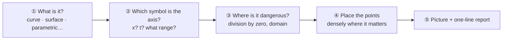
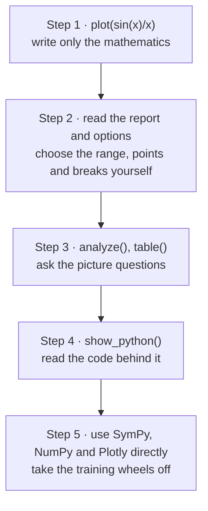

# Understanding MathSlate

**A guide to what MathSlate does on your behalf, and what it leaves to you.**

MathSlate has three documents, each for a different job.

| Document | Read it when | Think of it as |
|---|---|---|
| [Tutorial](tutorial.md) | You have thirty minutes and want to follow along by hand | Driving lessons |
| **This guide** | You wonder *why* it behaved that way, or what to reach for next | A map |
| [Reference manual](manual.md) | You need the exact meaning of one option | A dictionary |

This guide has few examples. It explains how MathSlate **thinks** instead. Once
you know that, you can roughly predict what an unfamiliar input will do, and an
error stops being a surprise.

---

## 1. In one sentence: MathSlate is an interpreter

Drawing mathematics on a computer normally takes three tools.

- **SymPy** handles expressions *as symbols*. It keeps `sin(x)/x` as a formula rather than a number, differentiates it, and solves equations.
- **NumPy** evaluates an expression *at many numbers at once*.
- **Plotly** turns the computed points into a *picture*.

The three speak different languages. An expert joins them with names like
`symbols`, `lambdify`, `linspace` and `go.Figure`. For a beginner, that joining
is harder than the mathematics.

MathSlate is the **interpreter** between them. You write mathematics, and
MathSlate phrases it for all three tools. Like a good interpreter, it also keeps
two promises.

1. **It does not hide what it decided for you.** Every graph comes with a one-line report.
2. **It will always show you the original.** Call `show_python()` and it prints the plain Python you would have written without MathSlate.

So MathSlate is not a pair of training wheels you keep forever. It is a pair
you take off when you are ready, and it shows you how.

```python
from mathslate import *

plot(sin(x)/x)
```

---

## 2. What happens when you call `plot()`

Behind the single line `plot(sin(x)/x)`, five steps run in order.



### ① What is it? MathSlate looks at the *shape* of the input

Before it reads the expression, MathSlate looks at **the brackets**.

- One expression → a curve
- A **list** `[ ... ]` → several things *drawn together* (several curves)
- A **tuple** `( ... )` → several values that make up *one* thing (a single moving point: a parametric curve)
- `Eq(left, right)` → where the two sides are equal (an implicit curve such as a circle)

The list/tuple distinction is the one Python already uses. A shopping list holds
separate items; the coordinate `(3, 4)` is two numbers that together make one
point.

```python
plot([sin(x), cos(x)])     # two curves, overlaid
plot((cos(t), sin(t)))     # one circle, traced by the point (cos t, sin t)
```

### ② Which symbol is the axis? It follows textbook convention

With one symbol there is nothing to decide. With several, MathSlate picks axes
the way a textbook would: `x, y, z` first, then `t`, then `r` and `theta`.

This is where new users are most often surprised: **if two symbols are left,
MathSlate draws a surface.**

```python
a = Symbol("a", real=True)
plot(a*sin(x))             # not a curve: a surface over x and a!
```

If you meant `a` as "a number I will choose later", say so:

```python
plot(a*sin(x), parameters={a: 2})     # the curve with a fixed at 2
```

`slider()` does the same thing with a handle you can drag (see §5).

With **three** symbols and no convention to choose between them, MathSlate
does not guess. It raises an error **that asks you a question**, and the message
contains a call you can use to fix it.

```python raises=AmbiguousAxisError
b, c = symbols("b c", real=True)
plot(a*b*c)
```

```text
AmbiguousAxisError: 3 free symbols found (a, b, c). Which 2 should be the axes?
Give an explicit range, e.g. plot(expr, (a, -10, 10), (b, -10, 10)).
```

When you give a range yourself, always put all three parts, `(symbol, start, end)`,
**in one pair of brackets**.

```python
plot(sin(x), (x, 0, 2*pi))
```

Written without the brackets, as in `plot(sin(x), 0, 6)`, it is refused: there
is no way to tell which symbol the range belongs to.

### ③ Where is it dangerous? It reads the expression *before* drawing

A typical graphing tool places points evenly and joins neighbours with a line.
That is why `tan(x)` often shows **vertical lines that do not exist**, where the
value leaps from +∞ to −∞. A student who sees them believes the function really
looks like that.

Before placing any points, MathSlate reads the expression with SymPy and looks for:

- places where a denominator is zero (`x = 0` in `1/x`)
- intervals where the expression is undefined (negative `x` for `sqrt(x)`, `x ≤ 0` for `log(x)`)
- places where the value jumps (every integer for `floor(x)`)

Wherever it finds one, **it breaks the line**. Not drawing lines that are not
there is what MathSlate works hardest at.

### ④ Placing the points: densely only where it matters

The points are not evenly spaced. They are sparse where the curve is gentle and
dense where it bends sharply or nears trouble. The same number of points gives a
more accurate picture, and it is why the sample count in the report differs from
one expression to the next.

### ⑤ The picture and the one-line report

```text
curve | x ∈ [-10, 10] | 411 samples | 1 discontinuity handled
  · singularities at x = 0
```

Read it left to right: "I understood this as a **curve**, drew **x from −10 to
10**, placed **411 points**, and handled **one break**, which is at **x = 0**."

The report is not a log; it is **the list of decisions made on your behalf**. If
you disagree with one, change it: the range with `(x, 0, 5)`, the number of
points with `points=`, where to break with `exclusions=`. If the report gets in
the way, `set_verbose(False)` turns it off.

---

## 3. Only three rules to remember

1. **A list means several; a tuple means one.** `[f, g]` is two curves; `(f, g)` is one curve traced by a point.
2. **A range is `(symbol, start, end)`**, all three in one pair of brackets.
3. **When something is ambiguous, MathSlate asks.** Read the error to the end; the call that fixes it is usually inside.

Everything else is a small extension of these three.

---

## 4. The result is an answer, not a picture

What `plot()` returns is not an image file but **an answer you can keep asking
questions** (a `PlotResult`). Keep it in a variable and ask on.

```python
f = plot(x**3 - 3*x, verbose=False)
```

| Ask this | To get this |
|---|---|
| `f.analyze()` | Roots, extrema, inflection points, symmetry, asymptotes, where it rises and falls |
| `f.table()` | The same function as a table of numbers |
| `f.show_python()` | The plain Python that makes this picture |
| `f.summary()` | The one-line report above |
| `f.figure` | The Plotly figure itself (for experts) |

For example, `analyze()`:

```python
print(f.analyze())
```

```text
     expression : x**3 - 3*x        (excerpt)
          roots : -sqrt(3), 0, sqrt(3)
         maxima : -1
         minima : 1
       symmetry : odd
  increasing on : (-10, -1), (1, 10)
  decreasing on : (-1, 1)
```

Notice that the answers are **exact values** such as `sqrt(3)`. When SymPy can
solve it, you get the exact value. When it cannot, MathSlate approximates
numerically and **labels the result as approximate**. It never mixes exact and
approximate answers without saying so.

`analyze()` tells you what is true. It does not show *how* it was found, that
is, the worked steps. Those are left to the lesson and the student.

---

## 5. What do you want to do?

| I want to… | Use | One-line example |
|---|---|---|
| Graph a function | `plot` | `plot(x**2 - 1)` |
| Compare several functions | `plot` + a list | `plot([sin(x), x - x**3/6])` |
| Trace a moving point (circle, spiral) | `plot` + a tuple | `plot((cos(t), sin(t)))` |
| Use polar coordinates `r = f(θ)` | `polar` | `polar(1 + cos(theta))` |
| Draw a function of two variables (a surface) | `plot` | `plot(x*y)` |
| See a surface flat, like a map | `kind="contour"` | `plot(x*y, kind="contour")` |
| Shade the region of an inequality | `plot` | `plot(x**2 + y**2 < 4)` |
| Find roots and extrema | `analyze` | `analyze(x**3 - 3*x)` |
| Get values as a table | `table` | `table(sin(x), (x, 0, 1))` |
| Change a coefficient with a handle | `slider` | `s = slider(1, 3, name="s")`, then `plot(s*sin(x))` |
| Make a moving picture | `animate` | `animate(s*sin(x))` |
| Fit a formula to my measurements | `dataset` + `.fit` | `dataset({...}).fit(m*x + q)` |
| See the real code behind it | `show_python` | `f.show_python()` |

Here are a few of them run for real.

```python
s = slider(1, 3, name="s")
plot(s*sin(x))
```

Once you make a slider, `s` is treated as a **value**, not an axis. So even with
two symbols you get a curve rather than a surface, with a handle under the
picture to change `s`. Think of it as a hands-on version of the `parameters=`
from §2.

```python
m, q = symbols("m q")
d = dataset({"x": [0, 1, 2, 3], "y": [1.1, 2.9, 5.2, 6.8]})
print(d.fit(m*x + q).describe())
```

```text
m*x + q  ->  m = 1.94, q = 1.09   [R² = 0.9957]
```

You write the model the way you would in a notebook, `m*x + q`. The result is
still a SymPy expression, so you can `plot()` it or `analyze()` it again.

---

## 6. When you are stuck: reading error messages

Most MathSlate errors tell you both **what was ambiguous** and **how to write it
instead**. The ones you will see most often:

| If you see | It means | Try |
|---|---|---|
| `Which 2 should be the axes?` | Too many symbols to pick the axes | Give ranges yourself, like `(a, -5, 5)`, or fix the rest with `parameters=` |
| `a range must be written (symbol, lo, hi)` | The range was written without brackets | `plot(f, (x, 0, 6))` |
| `... is still free` from `analyze()` or `table()` | The variable is chosen, but another symbol has no value | `parameters={a: 1}`, or a `slider()` |
| The picture comes out as a surface | Two symbols, so it was read as a function of two variables | If you meant a curve, fix one symbol with `parameters=` |
| The line breaks somewhere you did not expect | Breaks are found automatically | Check the `·` lines in the report; break at more places with `exclusions=[...]`, or turn off the numeric search with `exclusions=False` (singularities SymPy finds are still broken) |

If it still looks wrong, look at the result's `show_python()`. Everything
MathSlate did is written out there as code.

---

## 7. Growing one step at a time

MathSlate is designed as a ladder to climb.



The code at step 4 is not illustrative pseudo-code. **Copy it, run it, and you
get the same picture.** What MathSlate did quietly, such as drawing the pieces on
either side of a break separately, is shown too, with comments.

```python
f = plot(x**2, verbose=False)
code = f.python()          # f.show_python() prints it instead
print(code.splitlines()[0])
```

```text
# Equivalent code — this runs exactly as printed.
```

The `sin`, `diff` and `solve` you use in MathSlate are **SymPy's own**, not
renamed wrappers. What you learn here is SymPy knowledge you keep.

---

## 8. How far should you trust the AI helper?

The optional AI helper (`mathslate.ai`) turns a question in plain language into
MathSlate code. Without the AI packages, and without an internet connection,
everything else works exactly the same.

There is one rule for dealing with it: **code written by an AI is code, not an
answer.**

- `ask()` only **shows** the code; it does not run it. Read it first.
- `.run()` executes it in **restricted mode**: only the allowed mathematical functions, in a separate process, with a time limit. File access, network access and `import` are blocked, and environment variables such as API keys are not passed on.
- Check **facts** such as roots and extrema with the `analyze()` result SymPy computed, not with the AI's recollection.

`run(unsafe=True)` turns all of this protection off. Use it only on code you have
read yourself and trust.

---

## 9. Where to go next

- To follow along by hand → the [tutorial](tutorial.md)
- To look up one option exactly → the [reference manual](manual.md)
- To learn why MathSlate is shaped this way, and what it deliberately does not do → the [design document (PRD)](design/mathslate_prd_0.3.md)
