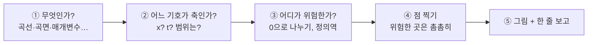
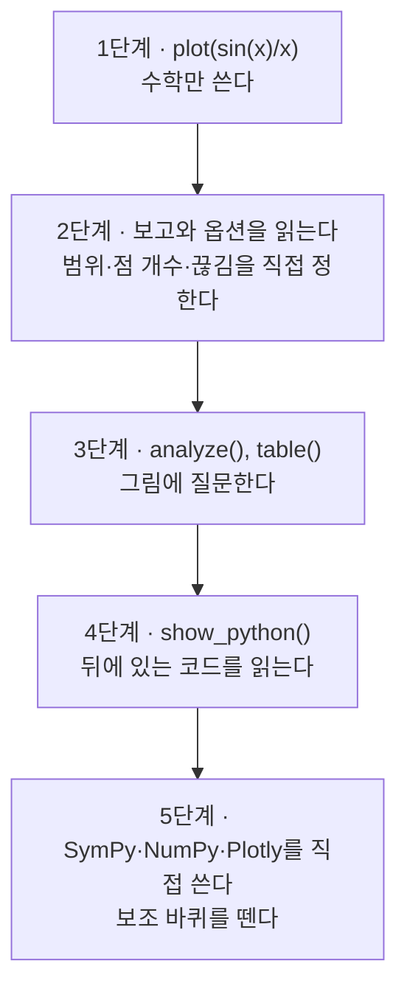

# MathSlate 이해하기

**MathSlate가 무엇을 대신 해 주고, 무엇을 여러분에게 맡기는지 알려 주는 안내서입니다.**

MathSlate 문서는 세 가지이고, 쓰임이 서로 다릅니다.

| 문서 | 이럴 때 읽으세요 | 비유 |
|---|---|---|
| [튜토리얼](tutorial_ko.md) | 처음 30분, 손으로 따라 해 보고 싶을 때 | 운전 연수 |
| **이 안내서** | "왜 이렇게 동작하지?"가 궁금할 때, 다음에 뭘 써야 할지 모를 때 | 지도 |
| [레퍼런스 매뉴얼](manual_ko.md) | 옵션 하나의 정확한 의미를 찾을 때 | 사전 |

이 안내서에는 예제가 많지 않습니다. 대신 MathSlate가 **어떻게 생각하는지** 설명합니다.
그 방식을 알고 나면 처음 보는 입력도 결과를 대략 예상할 수 있고, 오류가 나도
당황하지 않게 됩니다.

---

## 1. 한 문장으로: MathSlate는 통역사입니다

수학을 컴퓨터로 그리려면 원래 세 가지 도구를 알아야 합니다.

- **SymPy** — 식을 *기호 그대로* 다룹니다. `sin(x)/x`를 숫자가 아니라 식으로 기억하고, 미분하고, 방정식을 풉니다.
- **NumPy** — 식에 *숫자를 대량으로* 넣어 값을 계산합니다.
- **Plotly** — 계산된 점들을 *그림*으로 그립니다.

이 셋은 서로 다른 언어를 씁니다. 전문가는 `symbols`, `lambdify`, `linspace`,
`go.Figure` 같은 이름으로 셋을 이어 붙이지만, 처음 배우는 사람에게는 이 연결
작업이 수학보다 어렵습니다.

MathSlate는 이 사이의 **통역사**입니다. 여러분은 수학을 쓰고, MathSlate는 세 도구에게
전할 말을 대신 정리해 줍니다. 좋은 통역사처럼 두 가지 약속도 지킵니다.

1. **무엇을 대신 결정했는지 숨기지 않습니다.** 그래프를 그릴 때마다 한 줄 보고를 남깁니다.
2. **언제든 원문을 보여 줍니다.** `show_python()`을 부르면 MathSlate 없이 직접 짰을 순수 Python 코드를 그대로 보여 줍니다.

그래서 MathSlate는 평생 쓰는 보조 바퀴가 아닙니다. 필요 없어지면 떼어 내는 보조 바퀴이고,
떼는 방법까지 알려 줍니다.

```python
from mathslate import *

plot(sin(x)/x)
```

---

## 2. `plot()`을 부르면 일어나는 일

`plot(sin(x)/x)` 한 줄 뒤에서는 다섯 단계가 순서대로 일어납니다.



### ① 무엇인가? — 입력의 *모양*을 봅니다

MathSlate는 식의 내용보다 먼저 **괄호의 모양**을 봅니다.

- 식 하나 → 곡선
- **리스트** `[ ... ]` → 여러 개를 *겹쳐서* (곡선 여러 개)
- **튜플** `( ... )` → 여러 값이 모여 *하나*를 이룸 (점 하나가 움직이는 매개변수 곡선)
- `Eq(왼쪽, 오른쪽)` → 두 변이 같아지는 곳 (원 같은 음함수 곡선)

리스트와 튜플의 구분은 Python에서 이미 쓰는 뜻 그대로입니다. 장바구니(리스트)에는
물건이 따로따로 들어 있고, 좌표 `(3, 4)`(튜플)는 둘이 합쳐 점 하나입니다.

```python
plot([sin(x), cos(x)])     # 곡선 두 개를 겹쳐서
plot((cos(t), sin(t)))     # 점 (cos t, sin t)가 그리는 원 하나
```

### ② 어느 기호가 축인가? — 수학 교과서의 관례를 따릅니다

식에 기호가 하나면 고민할 게 없습니다. 기호가 여러 개일 때는 교과서 관례대로
`x, y, z`를 먼저, 그다음 `t`, 그다음 `r`, `theta`를 축으로 고릅니다.

여기서 처음 쓰는 분들이 가장 자주 놀랍니다. **기호가 두 개 남으면 MathSlate는 곡면을 그립니다.**

```python
a = Symbol("a", real=True)
plot(a*sin(x))             # 곡선이 아니라 x와 a 위의 곡면!
```

`a`를 "나중에 정할 숫자"로 쓰려던 거라면 그 뜻을 알려 주면 됩니다.

```python
plot(a*sin(x), parameters={a: 2})     # a = 2로 고정한 곡선
```

`slider()`를 쓰면 같은 일을 손잡이로 할 수 있습니다(§5 참고).

기호가 **세 개**이고 관례로도 축을 고를 수 없으면, MathSlate는 짐작하지 않고
**질문하는 오류**를 냅니다. 오류 메시지 안에 바로 고쳐 쓸 수 있는 호출이 들어 있습니다.

```python raises=AmbiguousAxisError
b, c = symbols("b c", real=True)
plot(a*b*c)
```

```text
AmbiguousAxisError: 3 free symbols found (a, b, c). Which 2 should be the axes?
Give an explicit range, e.g. plot(expr, (a, -10, 10), (b, -10, 10)).
```

범위를 직접 줄 때는 항상 `(기호, 시작, 끝)` 세 개를 **한 괄호에** 넣습니다.

```python
plot(sin(x), (x, 0, 2*pi))
```

`plot(sin(x), 0, 6)`처럼 괄호 없이 쓰면 어떤 기호의 범위인지 알 수 없어 거절됩니다.

### ③ 어디가 위험한가? — 그리기 *전에* 식을 읽습니다

보통의 그래프 도구는 점을 고르게 찍고 이웃한 점을 선으로 잇습니다. 그래서 `tan(x)`처럼
값이 +∞에서 −∞로 뛰는 곳에 **있지도 않은 세로선**이 생깁니다. 학생은 이 선을 보고
함수가 원래 그렇게 생겼다고 믿게 됩니다.

MathSlate는 점을 찍기 전에 SymPy로 식을 먼저 읽습니다.

- 분모가 0이 되는 곳 (`1/x`의 `x = 0`)
- 정의되지 않는 구간 (`sqrt(x)`의 음수 쪽, `log(x)`의 0 이하)
- 값이 갑자기 뛰는 곳 (`floor(x)`의 정수 지점)

찾아낸 곳에서는 **선을 끊습니다.** 없는 선을 그리지 않는 것, 이것이 MathSlate가 가장
공들이는 부분입니다.

### ④ 점 찍기 — 필요한 곳에만 촘촘히

고르게 찍지 않습니다. 완만한 곳은 성기게, 급하게 휘거나 위험한 곳 근처는 촘촘하게 찍습니다.
같은 개수의 점으로 더 정확한 그림이 나오고, 보고에 나오는 샘플 수가 식마다 다른 것도
이 때문입니다.

### ⑤ 그림과 한 줄 보고

```text
curve | x ∈ [-10, 10] | 411 samples | 1 discontinuity handled
  · singularities at x = 0
```

왼쪽부터 이렇게 읽습니다. "**곡선**으로 이해했고, **x를 −10부터 10까지** 그렸고,
점은 **411개** 찍었고, **끊어진 곳 하나**를 처리했습니다. 그곳은 **x = 0**입니다."

이 보고는 로그가 아니라 **대신 내린 결정의 목록**입니다. 결정이 마음에 들지 않으면
하나하나 바꿀 수 있습니다. 범위는 `(x, 0, 5)`, 점 개수는 `points=`, 끊을 위치는
`exclusions=`로 바꿉니다. 보고가 거슬리면 `set_verbose(False)`로 끌 수 있습니다.

---

## 3. 기억할 규칙은 세 개뿐입니다

1. **리스트는 여러 개, 튜플은 하나.** `[f, g]`는 두 곡선, `(f, g)`는 한 점이 그리는 곡선입니다.
2. **범위는 `(기호, 시작, 끝)`.** 셋을 한 괄호에 넣습니다.
3. **모호하면 MathSlate가 묻습니다.** 오류 메시지를 끝까지 읽으세요. 고쳐 쓸 호출이 대개 그 안에 있습니다.

나머지는 모두 이 세 규칙을 조금씩 확장한 것입니다.

---

## 4. 결과는 "그림"이 아니라 "대답"입니다

`plot()`이 돌려주는 것은 그림 파일이 아니라 **질문을 더 받을 수 있는 대답**
(`PlotResult`)입니다. 변수에 담아 두면 계속 물어볼 수 있습니다.

```python
f = plot(x**3 - 3*x, verbose=False)
```

| 이렇게 물으면 | 이런 답이 옵니다 |
|---|---|
| `f.analyze()` | 근, 극값, 변곡점, 대칭, 점근선, 증가·감소 구간 |
| `f.table()` | 같은 함수를 숫자 표로 |
| `f.show_python()` | 이 그림을 만드는 순수 Python 코드 |
| `f.summary()` | 위의 한 줄 보고 |
| `f.figure` | Plotly 그림 객체 자체 (전문가용) |

`analyze()`를 예로 들면 다음과 같습니다.

```python
print(f.analyze())
```

```text
     expression : x**3 - 3*x        (일부만 발췌)
          roots : -sqrt(3), 0, sqrt(3)
         maxima : -1
         minima : 1
       symmetry : odd
  increasing on : (-10, -1), (1, 10)
  decreasing on : (-1, 1)
```

답이 `sqrt(3)`처럼 **정확한 값**으로 나오는 점에 주목하세요. SymPy가 풀 수 있으면
정확한 값을 주고, 풀 수 없으면 숫자로 근사한 뒤 **근사값이라고 표시합니다.**
정확한 값과 근사값을 섞어 놓고 모른 척하지 않습니다.

`analyze()`는 무엇이 참인지만 알려 줍니다. *어떻게* 구했는지, 즉 풀이 과정은
보여 주지 않습니다. 그 과정은 수업과 학생의 몫으로 남겨 둡니다.

---

## 5. 무엇을 하고 싶나요?

| 하고 싶은 일 | 쓸 것 | 한 줄 예시 |
|---|---|---|
| 함수 그래프 그리기 | `plot` | `plot(x**2 - 1)` |
| 여러 함수 비교 | `plot` + 리스트 | `plot([sin(x), x - x**3/6])` |
| 원·나선 같은 움직이는 점 | `plot` + 튜플 | `plot((cos(t), sin(t)))` |
| 극좌표 `r = f(θ)` | `polar` | `polar(1 + cos(theta))` |
| 두 변수 함수 (곡면) | `plot` | `plot(x*y)` |
| 곡면을 지도처럼 평면으로 | `kind="contour"` | `plot(x*y, kind="contour")` |
| 부등식의 영역 | `plot` | `plot(x**2 + y**2 < 4)` |
| 근·극값 찾기 | `analyze` | `analyze(x**3 - 3*x)` |
| 값을 숫자 표로 | `table` | `table(sin(x), (x, 0, 1))` |
| 계수를 손잡이로 바꿔 보기 | `slider` | `s = slider(1, 3, name="s")` 후 `plot(s*sin(x))` |
| 움직이는 그림 | `animate` | `animate(s*sin(x))` |
| 내 측정 데이터에 식 맞추기 | `dataset` + `.fit` | `dataset({...}).fit(m*x + q)` |
| 그 뒤의 진짜 코드 보기 | `show_python` | `f.show_python()` |

예시 몇 개를 실제로 돌려 보면 다음과 같습니다.

```python
s = slider(1, 3, name="s")
plot(s*sin(x))
```

슬라이더를 만들면 `s`는 축이 아니라 **값**으로 취급됩니다. 그래서 기호가 둘인데도
곡면이 아니라 곡선이 되고, 그림 아래 손잡이로 `s`를 바꿀 수 있습니다.
§2에서 본 `parameters=`를 손으로 조작하는 버전이라고 생각하면 됩니다.

```python
m, q = symbols("m q")
d = dataset({"x": [0, 1, 2, 3], "y": [1.1, 2.9, 5.2, 6.8]})
print(d.fit(m*x + q).describe())
```

```text
m*x + q  ->  m = 1.94, q = 1.09   [R² = 0.9957]
```

모델은 공책에 쓰듯 `m*x + q`로 적습니다. 결과도 여전히 SymPy 식이라서,
다시 `plot()`하거나 `analyze()`할 수 있습니다.

---

## 6. 막혔을 때: 오류 메시지 읽는 법

MathSlate의 오류는 대부분 **"무엇이 모호했는지"와 "어떻게 쓰면 되는지"**를 함께 알려 줍니다.
자주 보는 경우는 다음과 같습니다.

| 이런 메시지가 나오면 | 뜻 | 이렇게 해 보세요 |
|---|---|---|
| `Which 2 should be the axes?` | 기호가 너무 많아 축을 고를 수 없음 | 범위를 `(a, -5, 5)`처럼 직접 주거나 `parameters=`로 나머지를 고정 |
| `a range must be written (symbol, lo, hi)` | 범위를 괄호 없이 씀 | `plot(f, (x, 0, 6))` |
| `analyze()`·`table()`에서 `... is still free` | 변수는 정했는데 나머지 기호에 값이 없음 | `parameters={a: 1}` 또는 `slider()` |
| 그림이 곡면으로 나옴 | 기호가 둘이라 두 변수 함수로 이해함 | 의도가 곡선이면 한 기호를 `parameters=`로 고정 |
| 선이 끊긴 곳이 예상과 다름 | 끊김을 자동으로 찾음 | 보고의 `·` 줄을 확인하고, 더 끊으려면 `exclusions=[...]`, 숫자 탐지를 끄려면 `exclusions=False` (SymPy가 찾은 특이점은 계속 끊음) |

그래도 이상하면 결과의 `show_python()`을 보세요. MathSlate가 무엇을 했는지
코드로 전부 나와 있습니다.

---

## 7. 한 걸음씩 자라기

MathSlate는 다음 사다리를 오르도록 설계되어 있습니다.



4단계에서 나오는 코드는 설명용 의사 코드가 아닙니다. **그대로 복사해 실행하면
같은 그림이 나옵니다.** MathSlate가 조용히 처리한 일, 예를 들어 끊긴 구간을 나눠
그리는 부분도 주석과 함께 드러납니다.

```python
f = plot(x**2, verbose=False)
code = f.python()          # 화면에 출력하려면 f.show_python()
print(code.splitlines()[0])
```

```text
# Equivalent code — this runs exactly as printed.
```

MathSlate에서 배운 `sin`, `diff`, `solve`는 모두 **SymPy의 것 그대로**입니다.
감싸서 이름만 바꾼 게 아니라서, 여기서 익힌 것은 그대로 SymPy 실력이 됩니다.

---

## 8. AI 도우미는 어디까지 믿어도 되나요?

선택 기능인 AI 도우미(`mathslate.ai`)는 자연어 질문을 MathSlate 코드로 바꿔 줍니다.
AI 패키지를 설치하지 않아도, 인터넷에 연결되어 있지 않아도 나머지 기능은 모두 그대로 동작합니다.

AI를 대하는 원칙은 하나입니다. **AI가 쓴 코드는 코드일 뿐, 답이 아닙니다.**

- `ask()`는 코드를 **보여 줄 뿐** 실행하지 않습니다. 먼저 읽어 보세요.
- `.run()`으로 실행하면 허용된 수학 함수만 쓸 수 있는 **제한 모드**로, 별도 프로세스에서, 시간 제한을 두고 돌아갑니다. 파일 읽기, 네트워크 접근, `import`는 막혀 있고 API 키 같은 환경변수도 넘어가지 않습니다.
- 근이나 극값 같은 **사실**은 AI의 기억이 아니라 SymPy가 계산한 `analyze()` 결과로 확인하세요.

`run(unsafe=True)`는 이 보호를 모두 끕니다. 내가 직접 읽고 믿을 수 있는 코드에만 쓰세요.

---

## 9. 다음으로

- 직접 따라 해 보고 싶다면 → [튜토리얼](tutorial_ko.md)
- 옵션 하나를 정확히 알고 싶다면 → [레퍼런스 매뉴얼](manual_ko.md)
- MathSlate가 왜 이런 모양인지, 일부러 하지 않기로 한 일은 무엇인지 궁금하다면 → [설계 문서(PRD)](design/mathslate_prd_0.3.md)
